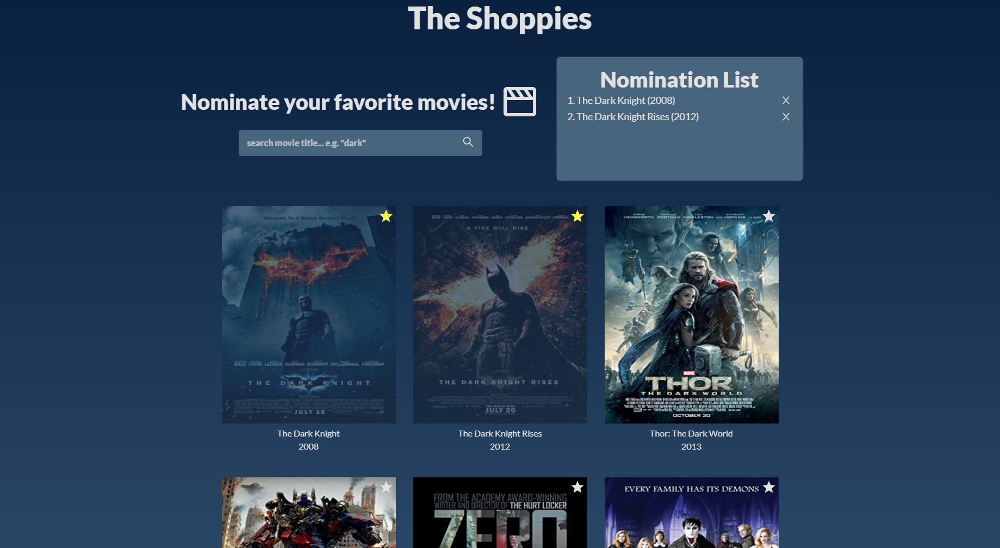

<!-- @format -->

# The Shoppies

Shopify intership challenge.

Movie app using the OMDB API to search for movies. Five movies can be nominated before a banner appears on the screen.

This project was bootstrapped with [Create React App](https://github.com/facebook/create-react-app).

## Available Scripts

In the project directory, you can run:

### `npm start`

Runs the app in the development mode.\
Open [http://localhost:3000](http://localhost:3000) to view it in the browser.
